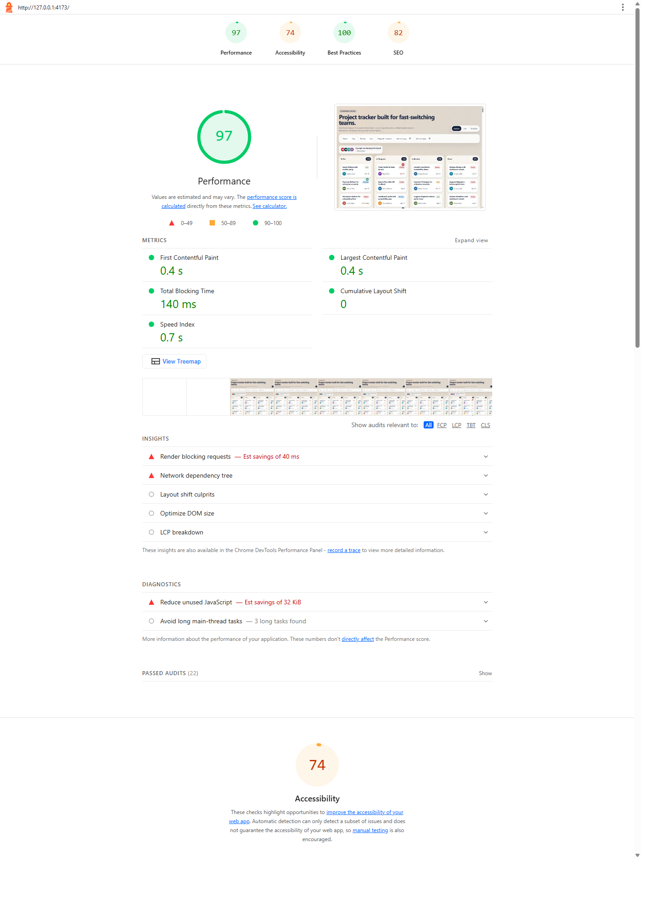

# TaskSphere

TaskSphere is a React + TypeScript project tracker UI that keeps one shared task dataset in sync across Kanban, List, and Timeline views. I built it without drag-and-drop, virtualization, or UI component libraries because the goal of this task felt more like proving frontend fundamentals than assembling packages.

## Live Link

https://tasksphere-9ze4.onrender.com

## Setup

```bash
npm install
npm run dev
```

For a production build:

```bash
npm run build
npm run preview
```

## Tech Choices

- React 19 + TypeScript + Vite
- CSS Modules for custom component styling
- React Context + `useReducer` for state management

## Why Context + useReducer

I chose React Context with `useReducer` because the app has one shared task dataset, a small set of predictable write actions, and several read-heavy views that all depend on the same source of truth. This kept the architecture lightweight while still making task updates, sort changes, filter updates, URL hydration, and view switching explicit through reducer actions. For this assignment, that tradeoff felt cleaner than introducing a separate state library for state that already fits naturally inside the React tree.

## Features

- Three synchronized views over the same in-memory task data
- Kanban board with independent column scroll areas and custom pointer-based drag-and-drop
- List view with custom virtual scrolling for 500+ generated rows
- Timeline view with month-based bars, a current-day marker, and single-day markers for tasks without a start date
- URL-synced filters for status, priority, assignee, and due date range
- Simulated live collaboration indicators with animated avatar movement
- Edge-case handling for empty states, overdue dates, and due-today labels

## Seed Data

The generator in `src/data/generateTasks.ts` creates 560 deterministic tasks using:

- 6 assignees
- 4 statuses
- 4 priorities
- randomized date windows
- overdue items
- tasks with missing start dates

## Virtual Scrolling Approach

The list view uses a fixed row height and computes the visible window from the scroll container's `scrollTop`. It renders only the rows inside the current viewport plus a buffer of five rows above and below. The full scroll height is preserved with an inner container set to the total list height, while each visible row is absolutely positioned using its virtual index. I kept it intentionally straightforward so the math is easy to follow and debug, and it still stays smooth with 500+ tasks.

Reference: `src/components/ListView.tsx`

## Drag-and-Drop Approach

The Kanban view uses native pointer events instead of a drag library. On pointer down, I capture the card's bounding box and render a floating drag ghost in a fixed layer. The original card is replaced by a placeholder with the same measured height so the column does not collapse. During pointer movement, the current cursor position is compared against column bounds to determine the active drop zone. If the pointer is released outside a valid column, the drag ghost animates back to its original rectangle for a snap-back effect.

Reference: `src/components/KanbanView.tsx`

## Lighthouse

Desktop Lighthouse score captured locally against the production build: `97` performance.



Additional artifacts:

- `lighthouse-report.report.html`
- `lighthouse-report.report.json`

## Explanation Field Draft

The hardest part of this UI was making the Kanban drag interaction feel custom while keeping the layout stable underneath it. I handled that by separating the dragged card from the board as soon as the gesture starts. The dragged card becomes a fixed-position ghost that follows the pointer, while the original slot is replaced with a placeholder that matches the measured card height. That kept the source column from collapsing, so nearby cards did not jump around while dragging.

The placeholder is created from the dragged card's actual bounding rectangle at drag start instead of from an estimated constant height. That mattered because titles vary in length and some cards are naturally taller than others. Measuring the real height prevented subtle layout shifts and made the interaction feel much more reliable.

With more time, I would refactor the collaboration layer into a slightly more dedicated positioning system that reacts to resize and scroll changes more aggressively, so presence indicators stay perfectly anchored during every layout transition and not just the main interaction paths already covered here.
# TASKSPHERE
